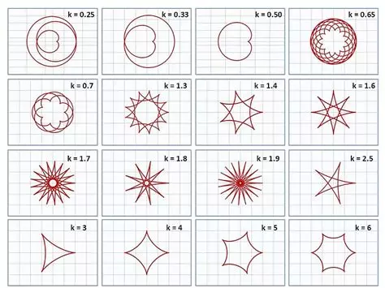

# Funciones paramétricas
"En el sistema de coordenadas bidimensional, las ecuaciones paramétricas son útiles para describir curvas que no son necesariamente funciones. El parámetro es una variable independiente de la que dependen tanto la variable x como la variable y, y a medida que aumenta el parámetro, los valores de x e y trazan una ruta a lo largo de una curva plana." [(Beltran, 2025)](https://calculo21.com/ecuaciones-parametricas/)    
Según cambian los valores de los parámetros, y según cambie las funciones $f(x)$ y $f(y)$, las ecuaciones paramétricas pueden dibujar diferentes curvas:
   
En el caso de la imágen, son curvas que dependen de potencias y ángulos, por eso hay diferentes valores de $k$. 

En este código se dibujan 3 tipos de curvas diferentes: 
* ***Cardioide***
  $$
    x(\theta) = 2a(1 \pm \cos(\theta))\cos(\theta)
  $$
  *Donde:*  
  $a$ es el factor de escalado  
  $\theta$ es el parámetro  

* ***Hipocicloide***
  $$  
    x(\theta) = (R - r)\cos(\theta) + r\cos(\frac{R - r}{r}\cdot \theta)  
  $$
  $$
    y(\theta) = (R - r)\sin(\theta) + r\sin(\frac{R - r}{r}\cdot \theta)
  $$
  *Donde:*  
  $R$ es el radio del círculo grande    
  $r$ es el radio del círculo pequeño   
  $\theta$ es el parámetro  

* ***Curvas de Lissajous***
  $$
    x(\theta) = A\sin(a\theta)
  $$
  $$
    y(\theta) = B\cos(b\theta)
  $$    
  *Donde:*    
  $A$ y $B$ son las amplitudes  
  $a$ y $b$ son las frecuencias     
  $\theta$ es el parámetro


## Graficar las funciones paramétricas

Empezamos con los imports y lo básico de OpenCV:
```python
import math
import cv2 as cv
import numpy as np
import random as ran

img_width, img_height = 800, 800
x_c, y_c = img_width // 2, img_height // 2

img1 = np.zeros((img_height, img_width, 3), np.uint8)
img2 = np.zeros((img_height, img_width, 3), np.uint8)
img3 = np.zeros((img_height, img_width, 3), np.uint8)
```
```numpy```, ```cv2``` y ```random``` son necesarias para trabajar la parte de visión por computadora, y ```math``` se utiliza para realizar los cálculos matemáticos. Posteriormente se crean las imágenes de fondo negro en donde se dibujarán las curvas paramétricas.   
Después, se definen los valores que servirán como parámetros para las funcoines que se van a dibujar:   
```python
a = 170 # escala de la figura
theta = 0 #angulo de rotacion

#variables para control del hipocicloide
n_puntas = 10
R = a #radio del hipocicloide
r = a / n_puntas #radio del ciclo pequeño
```
Se abre un ciclo en donde se dibujarán las figuras, cada una en su diferente ventana. Dentro del ciclo se escoge el color de forma aleatoria (ahí se implementa la librería ```random```) y se continúa con las funciones:
```python
while True:
    # color aleatorio en BGR
    color = (ran.randint(0, 255), ran.randint(0, 255), ran.randint(0, 255))
    
    # radio del cardioide en coordenadas polares
    rCardioide = a * (0.7 - math.cos(theta))

    # transformación polar -> cartesiano
    xCardioide = int(x_c - rCardioide * math.cos(theta))
    yCardioide = int(y_c - rCardioide * math.sin(theta))
    cv.circle(img1, (xCardioide, yCardioide), 3, color, -1)
    
    #hipocicloide
    xHipocicloide = int(x_c + (R - r) * math.cos(theta) + r * math.cos((R - r) / r * theta))
    yHipocicloide = int(y_c + (R - r) * math.sin(theta) - r * math.sin((R - r) / r * theta))
    cv.circle(img2, (xHipocicloide, yHipocicloide), 3, color, -1)
    
    #curva de lissajous
    xLissajous = int(x_c + 150*math.sin(3*theta))
    yLissajous = int(y_c + 150*math.cos(5*(theta)))
    cv.circle(img3, (xLissajous, yLissajous), 3, color, -1)

    theta += 0.008

    # mostrar imagenes
    cv.imshow("Curva de Lissajous", img3)
    cv.imshow(("Hipocilcoide de %d puntas") %n_puntas, img2)
    cv.imshow("Cardioide", img1)
    
    if cv.waitKey(2) & 0xFF == 27:  # ESC para salir
        break

cv.destroyAllWindows()
```
Espera a que se presione la tecla ESC y se cierran todos los dibujos.

## Resultados
